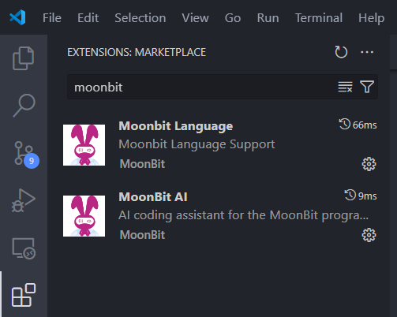
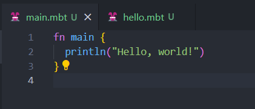

# moonbit-lang


> 背景，2022 年张宏波（ReScript语言开发者）加入了沈向洋院士创办的 IDEA 研究院，带队研发使用 WebAssembly 的云计算与边缘计算开发平台。 WebAssembly 是一个 2017 年才推出的新一代标准指令集，其潜在优势和开发前景很好。 不过目前在 WebAssembly 平台上，主流的 C++ 和 Rust 对开发人员的要求比较高；而应用层的 Go 语言，虽然在 WebAssembly 上运行，但它生成的代码体积巨大。
> 
> 基于前面的痛点，张宏波及其团队为了充分发挥 WebAssembly的优势，决定开发 moonbit(月兔)编程语言。


基于国内开发设计的编程语言，我充满好奇，于是，我花了一些时间，安装和使用moonbit-lang。


### 安装moonbit工具连


* windows为例, `PowerShell`中执行。

```bash
Set-ExecutionPolicy RemoteSigned -Scope CurrentUser; irm https://cli.moonbitlang.cn/windows_moon_setup.ps1 | iex
```

* 使用 moon 命令

```bash
> moon

Moonbit's build system

Usage: moon.exe <COMMAND>

Commands:
  build     Build the current package
  check     Check the current package, but don't build object files
  run       Run WebAssembly module
  clean     Remove the target directory
  new       Create a new moonbit package
  bench     Generate build matrix for benchmarking
  fmt       Format moonbit
  version   Print version info and exit
  test      Run the tests
  login     Log in to your account
  register  Register an account on mooncakes.io
  publish   Publish the current package
  add       Add a new dependency
  remove    Remove a dependency
  tree      Display the dependency tree
  update    Update index
  doc       Generate documentation
  install   Install dependencies
  upgrade   Upgrade toolchains
  help      Print this message or the help of the given subcommand(s)

Options:
  -h, --help  Print help
```

### 新建Moonbit项目

* 使用 `moon new` 命令，创建本地项目。

```bash
> moon new hello
```

* 使用`moon update ` 命令，更新本地索引信息。

```bash
> moon update
```

__项目目录结构__

```bash
└── hello
    ├── lib
    │   ├── hello.mbt
    │   ├── hello_test.mbt
    │   └── moon.pkg.json
    ├── main
    │   ├── main.mbt
    │   └── moon.pkg.json
    └── moon.mod.json
```

* `lib` 作为库目录，

* `main` 作为主程序目录。

* `hello.mbt` 作为库文件。

```mbt
pub fn hello() -> String {
  "Hello, world!"
}
```

`pub fn` 声明一个功能函数`hello()`，`-> String` 表示函数返回字符串类型。`Hello, world!` 即函数定义的字符串，没有变量名，也不需要`return`关键字，有一点点反直觉。


* `main/moon.pkg.json` 作为库的配置文件。

```json
{
  "is_main": true,
  "import": [
    "username/hello/lib"
  ]
}
```

`is_main` 表示该库是主程序，`import` 表示导入的库, `username/hello/lib` 即生成的项目目录。


* `main.mbt` 作为主程序文件。

```mbt
fn main {
  println(@lib.hello())
}
```

`@lib.hello()` 表示调用库文件`lib/hello.mbt`中的`hello()`函数。

如果不想使用lib，直接在main中打印字符串也是可以的。


```mbt
fn main {
  println("Hello, world!")
}
```

__运行项目__

```bash
> cd hello  # 进入hello项目根目录
> moon run main

Hello, world!

```

### vscode Moonbit插件

工欲善其事必先利其器，我们总不能用记事本写Moonbit代码吧！VSCode提供了Moonbit插件，至少有个代码高亮，代码不容易出错。

* VSCode插件



* 代码高亮



### Moonbit 语法

我简单的贴几个Moonbit 语言的使用例子，大家主观上Moonbit语言的语法有个了解。


* 函数调用

```mbt
fn foo(y : Int) -> Int {
  let x = 1
  x + y // OK
}

fn bar(z : Int) -> Int {
  let x = 1
  x + z
}

fn main {
  println("Hello, world!")
  println(foo(1))
  println(bar(2))
}

```

* 分支与循环

```mbt
pub fn some() -> Int {
  let mut i = 0
  let mut n = 0
  while i < 10 {
    i = i + 1
    if i == 3 {
      continue
    }
    if i == 8 {
      break
    }
    n = n + i
  }
  n
}


fn main {
  println(some()) // 输出25
}
```

* 数据结构

```mbt
pub fn some() -> Int {
  let mut i = 0
  let mut n = 0
  while i < 10 {
    i = i + 1
    if i == 3 {
      continue
    }
    if i == 8 {
      break
    }
    n = n + i
  }
  n
}

// 输出 25

fn main {
  println("Hello, world!")
  println(foo(1))
  println(bar(2))
  println(some()) // 输出25
}
```

* 数据结构

```mbt
struct User {
  id : Int
  name : String
  mut email : String
}

struct Name {
  firstName : String
  lastName : String
}

fn main {
  let u = { id: 0, name: "John Doe", email: "john@doe.com" }
  u.email = "john@doe.name"
  println(u.id)
  println(u.name)
  println(u.email)
  let n = { firstName: "John", lastName: "Doe" }
  println(n.firstName)
  println(n.lastName)
}
```

moonbit学习链接：

https://www.moonbitlang.cn/download/

https://mooncakes.io/docs/#/getting-started

https://www.moonbitlang.cn/docs/syntax

